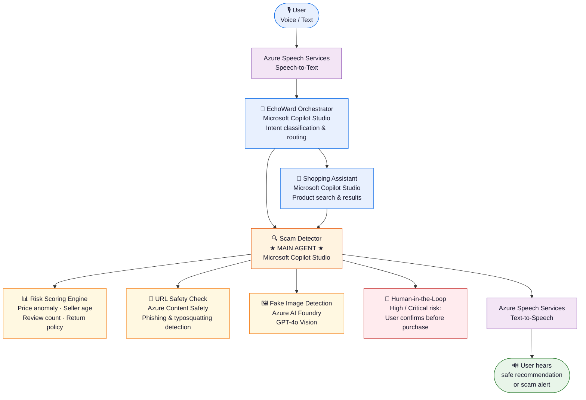
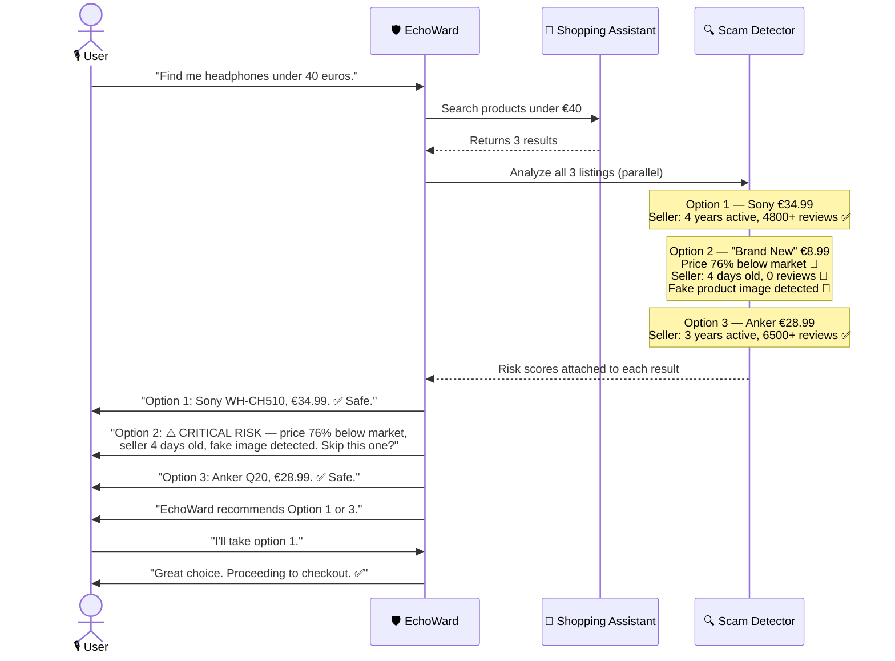

# EchoWard — Your voice, your shield. 🛡️

> A voice-first AI agent that protects vulnerable users from online shopping scams in real time.

**AI for Good Hackathon 2026 | March 27–28, 2026 | Online Event**

Built with **Microsoft Copilot Studio** | **Azure AI Foundry** | **Azure Speech Services**

---

## ❓ The Problem

Vulnerable populations — elderly users, people with visual impairments, and those with cognitive disabilities — are disproportionately targeted by online shopping scams:

- **1 in 3 elderly adults** reports being targeted by an online scam every year
- Financial exploitation of vulnerable adults costs **$28.3 billion annually** in the US alone
- Scam tactics (fake sellers, price manipulation, counterfeit listings) are increasingly sophisticated
- Existing platforms offer **no proactive fraud protection** at the point of purchase

**The gap:** Vulnerable users need a trusted companion that detects scams *before* they happen — not after.

---

## 🧩 Our Solution

EchoWard sits alongside the user during online shopping and:

1. **Analyzes every product listing** for fraud signals (seller reputation, price anomalies, URL safety, fake images)
2. **Alerts in plain language** — no jargon, just clear explanations a non-technical user understands
3. **Pauses high-risk transactions** with a human-in-the-loop confirmation before any money moves
4. **Voice-first** — works for visually impaired and elderly users who struggle with traditional UIs

---

## 🏗️ Architecture



| Color | Component |
|---|---|
| 🔵 Blue | Microsoft Copilot Studio agents & user |
| 🟠 Orange | Scam Detector — main agent |
| 🟡 Yellow | Risk scoring, URL check, image detection |
| 🔴 Red | Human-in-the-Loop approval |
| 🟣 Purple | Azure Speech Services (STT / TTS) |

---

## 👥 Team

Alexandra · Ceren · Sarper · Sarper Kahvecioglu · Sena

*Role assignments to be confirmed — 5 members, tasks TBD.*

---

## ⏱️ Hackathon Build Order (Day 2)

| Phase | Time | Deliverable |
|---|---|---|
| Setup | 12:00 – 12:15 | GitHub access, Copilot Studio, Azure — all confirmed |
| Phase 1 | 12:15 – 13:15 | Orchestrator + Scam Detector skeleton in Copilot Studio |
| Phase 2 | 13:15 – 14:30 | Scam logic wired up, Shopping Assistant connected, HITL flow |
| Phase 3 | 14:30 – 15:30 | Azure Foundry image check, Azure Speech voice I/O, frontend live |
| Phase 4 | 15:30 – 16:15 | End-to-end test with demo scenario, pitch polish |
| Pitch | 17:15 – 19:15 | Live demo + jury presentation |

---


## 🗂️ Repo Structure

```
echoward-ai-agent/
├── frontend/
│   ├── index.html
│   ├── style.css
│   └── app.js
├── backend/
│   ├── risk_scorer.py
│   └── README.md
├── demo-data/
│   ├── products.json
│   └── scam_cases.json
├── 00-Setup/
├── 01-Copilot-Studio/
│   ├── orchestrator/
│   ├── shopping-assistant/
│   └── scam-detector/
├── 02-Azure-AI-Foundry/
├── 03-Azure-Speech/
├── supportdocs/
└── use-cases/
```

---

## 🚨 What EchoWard Detects

| Signal | Example |
|---|---|
| Price too far below market | MacBook Pro at €189 (normally €2000+) |
| Brand-new seller, zero reviews | Account created 3 days ago |
| Suspicious URL | `amaz0n-deals.xyz` instead of `amazon.com` |
| Fake product image | Stock photo used for a "branded" item |
| No return policy | Seller blocks all refunds |

---

## 🗺️ Demo Scenario (Pitch)



---

## 🌍 Social Impact

| SDG | EchoWard Contribution |
|---|---|
| SDG 10 — Reduced Inequalities | Gives vulnerable users the same protection as tech-savvy users |
| SDG 16 — Peace, Justice & Strong Institutions | Actively combats financial exploitation |
| SDG 3 — Good Health & Well-being | Reduces financial stress and anxiety from scams |

---

## 📌 Project Metadata

- [CODE_OF_CONDUCT.md](CODE_OF_CONDUCT.md)
- [SECURITY.md](SECURITY.md)
- [SUPPORT.md](SUPPORT.md)
- [LICENSE](LICENSE)
